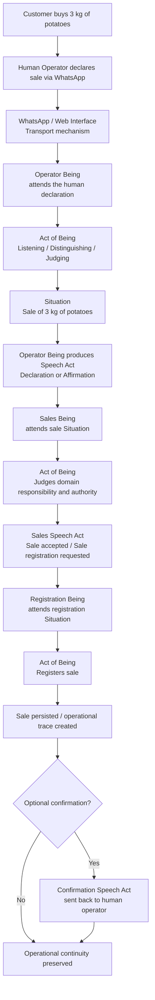
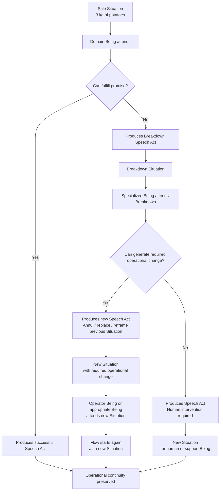

# LDOA / BODY EXAMPLE FLOW v0.2  
## From Human Language to Operational Reality

## 1. Purpose

This document explains, through a simple operational flow, how **Language-Driven Ontological Architecture (LDOA)** can be implemented by a runtime such as **BODY**.

The example is intentionally simple:

> A seller tells a WhatsApp assistant:  
> “I sold 3 kilograms of potatoes.”

From that sentence, the system does not merely store text.

It listens to a human declaration, interprets it as an operational Situation, transforms it into shared system language, and coordinates the required domains until the sale is registered.

Optionally, once the sale is registered, the system may confirm the result back to the real operator.

---

## 2. The Scenario

A customer buys 3 kilograms of potatoes in a small store.

The seller, acting as the human operator, writes through WhatsApp:

> “I sold 3 kilograms of potatoes.”

This message is not only text.

Within LDOA, it is treated as a human **Speech Act**.

The seller is declaring that a sale occurred.

The system must not reduce that declaration to a raw message, a database row, or a validation request.

The system must attend it as operational reality expressed through language.

---

## 3. Ontological Flow



---

## 4. What Happens Ontologically

The flow can be understood as a chain:

```text
Human Speech Act
→ Situation
→ Being
→ Act of Being
→ Speech Act
→ New Situation
→ Another Being
→ Operational Continuity
```

The seller’s WhatsApp message is not treated as a simple input.

It is treated as a human declaration of operational reality.

BODY receives that declaration through a transport mechanism, such as WhatsApp, a web interface, an API, or an event.

The transport is not the architecture.

The transport only carries the expression.

The architecture begins when a **Being** attends the declaration.

---

## 5. The Operator Being

The first Being in the flow is the **Operator Being**.

This Being represents the system’s ability to attend what the human operator said.

It performs Acts of Being such as:

```text
Listening
Distinguishing
Judging
Producing
```

It listens to the WhatsApp message.

It distinguishes that the message refers to a sale.

It judges whether the message has enough operational meaning.

It produces a new Speech Act into the shared language of the system.

For example:

```text
Declaration: Sale of 3 kg of potatoes occurred.
```

or, depending on authority:

```text
Affirmation: The operator reports a sale of 3 kg of potatoes.
```

The difference matters.

If the human operator has authority in the sales domain, the system may treat the act as a Declaration.

If authority is not yet established, the system may treat it as an Affirmation that must be attended by another Being.

---

## 6. Domain Beings

Once the sale Situation exists in shared operational language, other Beings may attend it.

For example:

```text
Sales Being
Inventory Being
Accounting Being
Registration Being
```

Each Being listens from its own domain.

The Sales Being may accept the sale.

The Inventory Being may update stock.

The Accounting Being may prepare or register accounting impact.

The Registration Being may persist the operational trace.

Each domain does not merely receive data.

Each domain attends the Situation according to its own promise, authority, judgment criteria, and capabilities.

---

## 7. Registration Flow

The Registration Being is responsible for recording the sale.

It does not decide whether the sale occurred.

The sale already occurred in operational reality.

The Registration Being only fulfills the promise of creating a trace.

If registration succeeds, the sale becomes available as a persisted operational record.

At that point, the system may optionally produce a confirmation back to the human operator:

> “Sale registered: 3 kilograms of potatoes.”

This confirmation is also a Speech Act.

It affirms to the human operator that the system preserved the operational trace.

---

## 8. Breakdown and Reprocessing Flow

If something fails, the sale does not disappear.

For example:

```text
The product does not exist in inventory.
The database is unavailable.
The sale cannot be persisted.
The operator lacks authority.
The message is ambiguous.
```

In a conventional system, one of these failures may cancel the operation, retry the same command, or update a previous record.

In LDOA/BODY, the failure becomes a new Situation.



A Breakdown does not deny the sale.

It declares that something interrupted operational continuity.

If the problem can be handled automatically, the system does not simply update the previous state or retry the same operation.

Instead, it produces a new Speech Act that creates a new Situation.

That new Situation may annul, replace, or reframe the previous Situation.

The previous Situation remains traceable, but it is no longer the active operational path.

The flow then begins again as a new Situation to be attended by the Operator Being or by the appropriate Being in the metastructure.

In this model:

```text
Nothing is silently updated.
Nothing is overwritten.
Nothing disappears.
```

A previous Situation may be annulled only through a new Situation.

A corrected operational path is created through language, not through hidden mutation.

This preserves traceability, authority, and operational continuity.

---

## 9. Annulment, Replacement, and New Situations

BODY does not correct reality by mutating the past.

When an operational correction is needed, BODY produces a new Situation.

That new Situation may declare that a previous Situation is annulled, replaced, superseded, or reframed.

For example:

```text
Original Situation:
Sale declared: 3 kg of potatoes.

Breakdown:
Product not recognized by inventory.

New Situation:
Previous product reference annulled.
Sale reframed using corrected product identity.
```

The original Situation remains part of the operational trace.

The corrected Situation becomes the new active operational path.

This allows the system to preserve both:

```text
historical traceability
operational continuity
```

The system can then continue processing without pretending that the previous Situation never existed.

---

## 10. The Central Principle

The central principle of this flow is:

```text
The system does not punish operational reality because reality does not fit the system.
```

If the seller sold 3 kilograms of potatoes, that operational reality must not disappear because the database failed, the product was missing, or the schema was insufficient.

The system must distinguish:

```text
The sale occurred.
The system could not complete a required operation.
A new Breakdown must be attended.
A new Situation may be required to annul, replace, or reframe the previous one.
```

This is the key difference between LDOA/BODY and many traditional software flows.

The technical failure does not erase the operational act.

It creates a new Situation.

If a correction is possible, the correction also enters the system as a new Situation.

---

## 11. Transport Independence

This example uses WhatsApp.

But WhatsApp is not essential to the pattern.

The same flow could start from:

```text
WhatsApp
Web form
REST API
Voice assistant
Event stream
Mobile app
Manual entry
Scheduled process
```

LDOA does not prescribe the transport mechanism.

What matters is that the operational reality can be expressed, attended, judged, and continued through shared language.

BODY, as an implementation, may use any suitable transport mechanism.

The ontology remains the same.

---

## 12. Summary

In this example, a simple WhatsApp message becomes an operational flow.

The seller speaks.

A Being listens.

The system distinguishes a Situation.

The Being performs Acts of Being.

A Speech Act is produced.

Other Beings attend that Speech Act as a new Situation.

Each domain fulfills its promise.

If something fails, the system does not deny reality.

It declares a Breakdown.

If the Breakdown can be handled automatically, BODY does not mutate the previous Situation.

It produces a new Speech Act that creates a new Situation.

The previous Situation may be annulled, replaced, or reframed, but it remains traceable.

Operational continuity is preserved.

In short:

```text
Human language becomes operational reality.
Operational reality becomes Situation.
Situation is attended by Beings.
Beings perform Acts of Being.
Acts of Being produce Speech Acts.
Speech Acts create new Situations.
Breakdowns also create new Situations.
Corrections are expressed as new Situations.
The system continues until the work is fulfilled or a Breakdown is made addressable.
```
