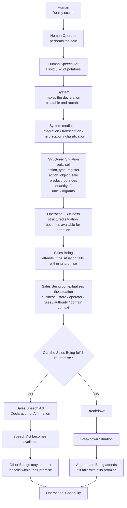

# LDOA Example Flow — Extended Version v1.0
## From Human Declaration to Operational Continuity

## 1. Purpose

This document presents an extended example of **Language-Driven Ontological Architecture (LDOA)**.

It uses the same simple business situation as the short example:

> A seller says through WhatsApp:  
> “I sold 3 kilograms of potatoes.”

The short example shows the flow.

This extended example shows where each LDOA rule applies inside that flow.

The purpose is not to expose the internal design of a specific runtime.

BODY may be understood as one possible runtime implementation of this pattern, but the focus here is LDOA itself.

This example follows the core definition of LDOA:

> An architectural pattern in which situations from reality are attended by Beings operating within the ontological domain of language, maintaining operational continuity.

---

## 2. Simplified Areas

For this example, the flow is grouped into three simplified areas:

```text
Human
→ System
→ Operation / Business
```

These areas are explanatory abstractions.

They are not a complete or definitive description of any specific runtime implementation.

The reason for this simplification is to keep the example focused on the architectural behavior:

```text
Situation
→ Being attends
→ Speech Act
→ new attendable situation
→ operational continuity
```

---

## 3. Flow Diagram



The diagram is intentionally simplified.

It shows the invariant:

```text
a situation is expressed
the system makes it treatable and routable
operation makes it available for attention
a Being attends it if it falls within its promise
the Being contextualizes it as needed
the Being produces a Speech Act
other Beings attend that Speech Act if it falls within their promise
continuity is maintained
```

---

## 4. Human Area

In the Human area, reality occurs and is expressed.

In the example:

```text
A customer buys 3 kilograms of potatoes.
The human operator performs the sale.
The human operator declares:
“I sold 3 kilograms of potatoes.”
```

This declaration is a human Speech Act.

It expresses a situation from reality.

The human operator is not adapting to the system’s internal model.

The human operator is expressing what occurred.

### Rule applied

```text
Operational reality comes first.

The system does not create the reality.

The system must later make the declaration treatable.
```

---

## 5. System Area

In this example, **System** is the area where the human declaration is made treatable and routable.

This does not mean that the system creates operational reality.

The system mediates the expression so it can be attended in operation.

For this example, the System area groups responsibilities such as:

```text
integration
transcription
interpretation
action classification
routing preparation
```

These responsibilities may be performed by Beings, services, capabilities, or other implementation mechanisms.

They are grouped here to keep the example focused on the LDOA pattern.

---

## 6. Integration

Integration allows the expression to enter the system boundary.

In the example, WhatsApp is the interface and the webhook carries the expression into the system.

Other implementations may use:

```text
web form
REST API
voice assistant
mobile app
event stream
manual entry
scheduled process
```

The integration mechanism is not the architecture.

It is only the transport.

### Rule applied

```text
Transport is not the pattern.

Transport carries the expression.

LDOA begins when the expressed situation becomes attendable.
```

---

## 7. Transcription

Transcription makes the expression available as language that can continue.

If the human declaration entered as audio, it may become text.

If it entered as text, it may continue unchanged.

At this point, the system is not contextualizing the business situation.

It is preserving or stabilizing the expression so it can continue as language.

### Rule applied

```text
Transcription does not register the sale.

Transcription does not contextualize the business.

Transcription only makes the expression continue as language.
```

---

## 8. Interpretation and Action Classification

Interpretation does not contextualize the situation within a business domain.

Interpretation extracts and classifies the actionable structure of the situation.

For the expression:

```text
I sold 3 kilograms of potatoes.
```

the system may classify:

```text
verb: sell
action_type: register
action_object: sale
attributes:
  product: potatoes
  quantity: 3
  unit: kilograms
```

This does not yet mean:

```text
The sale was registered.
The sale was accepted.
The sale belongs to a specific inventory.
The operator has authority.
The product exists in the catalog.
The accounting impact was produced.
```

Interpretation makes the situation treatable.

Classification makes it routable.

Operation gives it business meaning.

### Rule applied

```text
Interpretation classifies the actionable structure.

Interpretation does not complete business contextualization.

The structured situation is not the final business result.
```

---

## 9. Structured Situation

After system mediation, the human declaration becomes a structured situation.

For example:

```text
Structured Situation:
  source: human declaration
  verb: sell
  action_type: register
  action_object: sale
  attributes:
    product: potatoes
    quantity: 3
    unit: kilograms
```

The structured situation is not the final business result.

It is now suitable for contextualization by any Being whose promise includes attending this kind of situation.

### Rule applied

```text
The structured situation is attendable.

It is not yet accepted, registered, or declared in a business domain.

A Being must attend it if it falls within its promise.
```

---

## 10. Operation / Business Area

The Operation / Business area is where the structured situation becomes meaningful for Beings that operate over business reality.

This is where contextualization occurs.

Contextualization may include:

```text
business
store
operator
domain
promise
authority
rules
catalog
inventory
sales conditions
registration rules
accounting implications
operational policies
```

In the Operation / Business area, the structured situation becomes available for attention.

The domain does not attend the situation.

A Being attends the situation if it falls within its promise.

### Rule applied

```text
Operation / Business is where contextualization occurs.

The domain gives context, boundaries, and authority conditions.

The Being attends.

The domain does not listen.
```

---

## 11. Beings Attend, Not Domains

In this example, a Sales Being may have a promise such as:

```text
Attend structured situations where:
action_type = register
action_object = sale
```

The Sales Being attends the structured situation because it falls within its promise.

The Sales Being contextualizes the situation using the relevant business and Sales domain context.

The Sales Being may live in one domain and operate over situations that appear in another domain, as long as attending those situations falls within its promise.

However, producing a Declaration with transformative force in a domain requires authority for that domain.

### Rule applied

```text
Promise determines what a Being may attend.

Authority determines the operational force of what a Being may produce.

Domain provides context and the boundary where authority has meaning.
```

---

## 12. Sales Being Attention

After attending the structured situation, the Sales Being fulfills or attempts to fulfill its promise.

For example:

```text
register the sale
validate the required business context
associate product and quantity
determine whether the operator has authority
produce a Sales Speech Act
```

If the Sales Being fulfills its promise and has authority, it may produce a Sales Declaration:

```text
Declaration:
The sale was registered / accepted in the Sales domain.
```

That Declaration changes the world of the Sales domain.

Other Beings may attend that Declaration if it falls within their own promise.

### Rule applied

```text
A Declaration transforms operational reality when authority exists.

A Being cannot declare with transformative force in a domain unless it has authority in that domain.

Other Beings attend the produced Speech Act only if it falls within their promise.
```

---

## 13. Affirmation Path

If the Sales Being needs only to report or confirm something without transforming the domain again, it may produce an Affirmation.

For example:

```text
Affirmation:
The sale registration was completed.
```

That Affirmation may continue the operation toward communication with the human operator.

For example:

```text
Your sale was registered.
```

This response does not register the sale again.

It confirms that the sale was registered.

### Rule applied

```text
An Affirmation confirms, reports, coordinates, or leaves trace.

An Affirmation does not transform operational reality by itself.

An Affirmation may still provide operational continuity.
```

---

## 14. Breakdown Path

If the Sales Being cannot fulfill its promise, it produces a Breakdown.

For example:

```text
Breakdown:
The sale could not be registered because the product was not recognized.
```

A Breakdown does not deny the original situation.

It exposes that the Being could not continue or fulfill its promise.

The Breakdown becomes a new Situation.

Another Being may attend that Breakdown if it falls within its promise.

### Rule applied

```text
Breakdown is a native Speech Act.

Breakdown creates a new Situation to be attended.

Continuity does not mean that everything succeeds.

Continuity means that what happens remains attendable.
```

---

## 15. Downstream Beings

Other Beings do not need to attend the original WhatsApp message.

They attend the Speech Acts produced by previous Beings if those Speech Acts fall within their promise.

Those Beings may live or operate in other domains.

For example, after a Sales Declaration:

```text
An Inventory Being may attend stock impact.
An Accounting Being may attend accounting impact.
A Registration Being may attend traceability.
A Reporting Being may attend reporting impact.
```

Each Being attends according to its own promise.

Each Being may affirm, declare, or break down.

No Being should declare outside its authority.

### Rule applied

```text
Beings do not communicate directly with other Beings.

A Being produces a Speech Act.

Other Beings attend the produced Speech Act only if it falls within their promise.

The chain of continuity is produced through Speech Acts, not through hidden mutation.
```

---

## 16. Correction, Annulment, and Reframing

LDOA does not correct reality by silently mutating the past.

When an operational correction is needed, a new Situation is produced.

For example:

```text
Original Human Declaration:
I sold 3 kg of potatoes.

Structured Situation:
action_type: register
action_object: sale
product: potatoes
quantity: 3
unit: kilograms

Sales Declaration:
The sale was registered in the Sales domain.

New Situation:
The previous Sales Declaration must be corrected.

Correction Declaration:
The previous Sales Declaration was annulled.
A corrected Sales Declaration was produced.
```

The original Situation remains part of the operational trace.

The corrected Situation becomes the new active operational path.

### Rule applied

```text
Nothing is silently updated.

Nothing is overwritten.

Nothing disappears.

A previous Situation may be annulled only through a new Situation.
```

---

## 17. Summary of the Extended Example

In this example:

```text
Reality is expressed as a human declaration.

The system makes the declaration treatable and routable.

Interpretation extracts and classifies the actionable structure.

Operation / Business makes the structured situation available for attention.

A Being attends only if the situation falls within its promise.

Domains do not attend situations; Beings do.

The Being contextualizes the situation using relevant operational and domain context.

The Being fulfills or attempts to fulfill its promise.

The Being produces a Declaration, Affirmation, or Breakdown.

Declarations transform operational reality when authority exists.

Affirmations coordinate, confirm, report, or leave trace without transforming that reality.

Breakdowns become new Situations.

Other Beings attend produced Speech Acts only if they fall within their promise.

Operational continuity is maintained.
```
